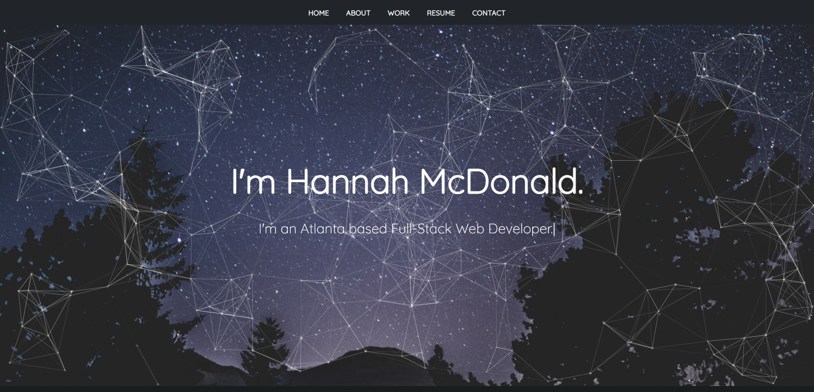

# Hannah McDonald's Portfolio Made With React 

## Table of Contents
1. [Technologies](##Technologies)
1. [Usage](##Usage)
1. [License](##License)
1. [Questions](##Questions)

## Technologies

**Languages:** Javascript, Node.js

**Front-End:** React & Bootstrap

**Cloud Platform:** Github Pages

**npm Packages:** 
1. [Font Awesome Icons](https://www.npmjs.com/package/@fortawesome/free-solid-svg-icons)
1. [react-particles-js](https://www.npmjs.com/package/particlesjs)
1. [react-icons](https://www.npmjs.com/package/react-icons)
1. [react scroll](https://www.npmjs.com/package/react-scroll)
1. [react-scroll-to-top](https://www.npmjs.com/package/react-scroll-to-top)
1. [react-typed](https://www.npmjs.com/package/react-typed)
1. [React Hook Error Form](https://www.npmjs.com/package/@hookform/error-message)

&& [emailjs](emailjs.com) for contact form.

## Usage

Deployed site: https://hannahnmcdonald.github.io/react_portfolio/

## License

This repository is under the MIT License.

## Questions?

Contact me at hannahcodes@protonmail.com 📫 or through my Github profile [here.](https://github.com/hannahnmcdonald) ✨

